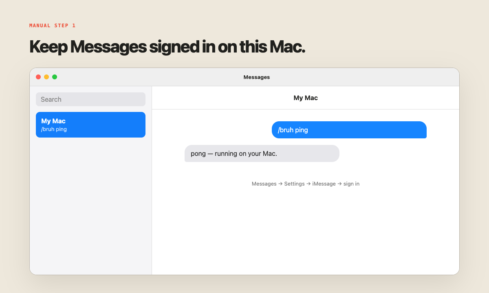
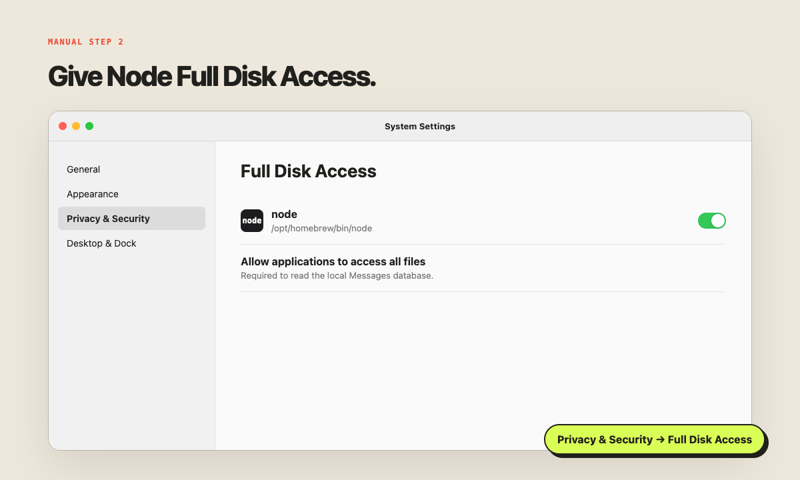
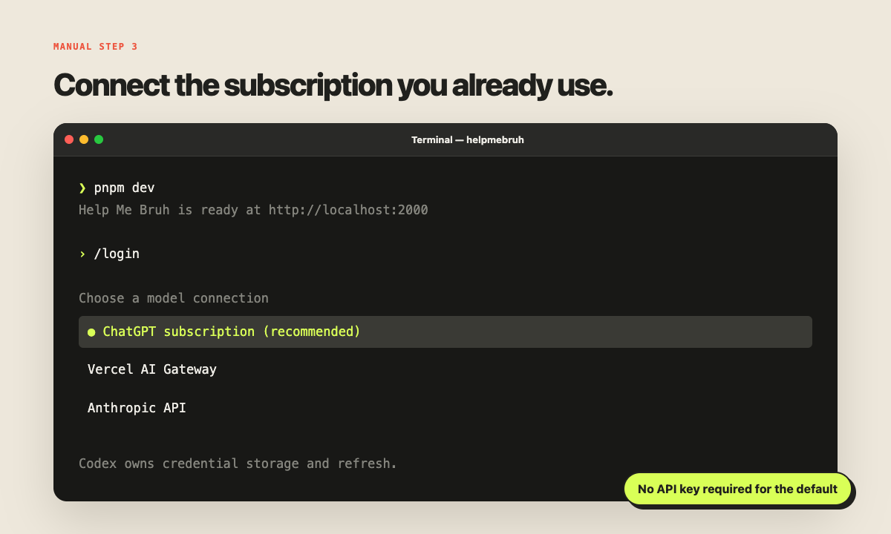
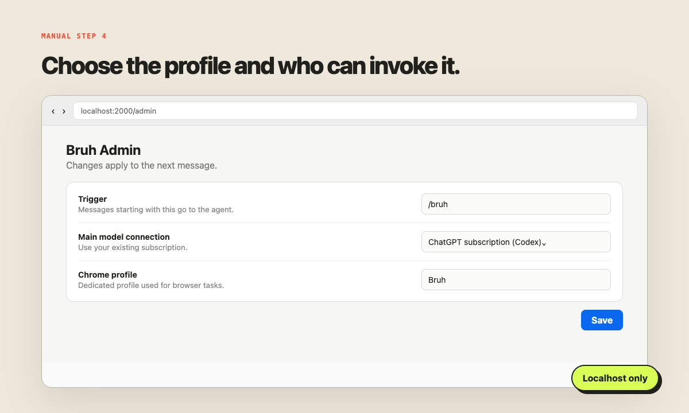

<div align="center">

# /bruh

**Open-source instinct for your Mac mini.**

[Website](https://helpmebruh.com) · [Install](#quick-start) · [How it works](#how-it-works) · [Security](#security)

</div>

Help Me Bruh is a personal assistant that lives in iMessage and runs on your Mac. Start a message with `/bruh`; it reads the request, uses the tools and accounts you choose, and replies from your existing iMessage account.

It works in DMs and group iMessages. The bridge, agent, browser session, sandboxes, and credentials stay on your machine.

## What it can do

- Search and fetch the web
- Use a dedicated, signed-in Chrome profile
- Work with Gmail, Calendar, and other connected apps
- Run code in isolated local sandboxes
- Hand coding tasks to Claude Code or Codex on your Mac
- Discover Codex and Claude Code capabilities; install Codex plugins in Bruh Admin
- Create images and send files back through iMessage
- Keep context from the chat or reply thread
- Restrict group access to you, an allowlist, or everyone

## Dependencies

Required:

- A Mac running macOS with Messages signed in
- [Node.js 24+](https://nodejs.org/) and [pnpm](https://pnpm.io/installation)
- An Apple silicon Mac for the bundled local sandbox runtime
- A model connection:
  - **Default:** a ChatGPT subscription, connected through Codex/Eve
  - **Optional:** Vercel AI Gateway or an Anthropic API key

Optional:

- [Google Chrome](https://www.google.com/chrome/) for signed-in browser use
- [Claude Code](https://docs.anthropic.com/en/docs/claude-code/getting-started) or [Codex CLI](https://developers.openai.com/codex/cli/) for coding tasks, installed skills, plugins, and MCP servers
- [Composio](https://composio.dev/) for Gmail, Calendar, and other app connections

> Claude Pro/Max can authenticate Claude Code for delegated coding tasks. Eve currently supports a ChatGPT subscription as its local main-model connection; using Claude as the main model requires an Anthropic API key or Gateway model.

## Quick start

```bash
git clone https://github.com/tomkit/helpmebruh.git
cd helpmebruh
corepack enable
pnpm install
cp .env.example .env
pnpm setup:secret
```

Then complete the manual steps below before installing the background services.

## Manual setup

### 1. Sign in to Messages

Open **Messages → Settings → iMessage** and sign in to the account the assistant should reply from. Keep Messages open for the first test.



### 2. Grant Full Disk Access

Find the Node binary used by this project:

```bash
which node
```

Open **System Settings → Privacy & Security → Full Disk Access**, add that Node binary, and turn it on. The bridge needs this permission to read `~/Library/Messages/chat.db`.



macOS may also ask whether Node can control Messages when the first reply is sent. Choose **Allow**.

### 3. Connect the model

Run the development server:

```bash
pnpm dev
```

Type `/login`, choose **ChatGPT subscription**, and complete the browser sign-in. If Codex is installed, Eve uses `codex app-server` and Codex keeps ownership of the credentials.

To use Vercel AI Gateway or Anthropic API instead, put the relevant key in `.env` and select that connection later in the admin page.



### 4. Configure Bruh

With `pnpm dev` still running, open [http://localhost:2000/admin](http://localhost:2000/admin).

Set:

- Trigger: `/bruh`
- Main model connection and model
- Who can invoke it in group chats
- A dedicated Chrome profile name, if using browser control
- Claude Code or Codex as the default coding agent

For Chrome, find the profile directory at `chrome://version` under **Profile Path**. You can enter either its display name or directory name, such as `Default` or `Profile 1`.



### 5. Install the LaunchAgents

Stop the development server, then run:

```bash
pnpm services:install
pnpm services:status
```

This installs two user LaunchAgents:

- `com.helpmebruh.agent` — the Eve agent on `127.0.0.1:2000`
- `com.helpmebruh.bridge` — the iMessage database watcher and reply bridge

Both start at login and restart after a crash.

### 6. Test it

Send yourself:

```text
/bruh ping
```

You should get a reply from the same iMessage account. If not, inspect the logs:

```bash
pnpm services:logs
# in another terminal
pnpm services:logs agent
```

## Model connections

| Connection | Main assistant | Coding tasks | Credential owner |
|---|---:|---:|---|
| ChatGPT subscription / Codex | Yes, default | Yes | Codex or Eve’s macOS Keychain entry |
| Claude Code Pro/Max | No | Yes | Claude Code |
| Vercel AI Gateway | Yes | — | `.env` or linked Vercel project |
| Anthropic API | Yes | — | `.env` |

Fresh installs default to the ChatGPT subscription path. Existing installs created before this option keep their Gateway model until changed in the admin page.

## Plugins and capabilities

Open [Bruh Admin](http://localhost:2000/admin) and use **Capabilities & plugins**. It discovers enabled plugins, skills, and MCP servers from your existing Codex and Claude Code setups. Click **Refresh capabilities** to see new installs. Bruh checks the live inventory before use and starts a fresh local CLI session for each request, so no Bruh rebuild or restart is needed. A plugin's own login or account setup may still be required.

To add a Codex plugin there, enter a trusted GitHub marketplace (`owner/repo`), then install `name@marketplace`. It installs into your Mac's regular `~/.codex` profile. Plugins can access local files or connected services, so choose sources you trust.

For StarCraft II coaching, add `tomkit/sc2-mcp`, then install `sc2-coach@starcraft2-ai`. Ask `/bruh analyze my last SC2 game`. The SC2 server may first ask you to connect your StarCraft2.ai account. Uploading and reading reports are free; creating a new AI Coach report costs one mineral and requires your confirmation.

## How it works

```text
iMessage
   │  /bruh request
   ▼
Node bridge ── reads local chat.db + thread context
   │
   ▼
Eve agent ─── model + tools + per-chat session
   │
   ├── signed-in Chrome profile
   ├── isolated Linux sandbox
   ├── Claude Code / Codex
   ├── installed Codex / Claude Code capabilities
   └── connected apps
   │
   ▼
Messages.app ── sends the reply and attachments
```

The bridge only handles messages that begin with the configured trigger. Each iMessage chat maps to its own durable Eve session.

## Security

- The HTTP agent listens on `127.0.0.1`, not the network.
- Bridge requests require a generated shared secret.
- Browser and coding tools are owner-only, even in open group chats.
- Consequential actions—sending, posting, deleting, buying, accepting—require a follow-up confirmation.
- Browser use copies only the selected Chrome profile into an isolated automation session.
- Coding agents cannot edit this project through the assistant and are sandboxed to one project directory.
- `.env`, chat state, browser state, builds, and generated files are ignored by Git.

Anyone able to run processes as your macOS user can potentially access the same local data. Treat the Mac and its login account as the trust boundary.

## Development

```bash
pnpm dev          # local Eve server + TUI
pnpm typecheck    # TypeScript
pnpm build        # production build
```

The static website lives in [`docs/`](docs/) and is ready for GitHub Pages with the custom domain `helpmebruh.com`.

## Service commands

```bash
pnpm services:status
pnpm services:restart
pnpm services:logs
pnpm services:uninstall
```

Uninstalling stops and removes the LaunchAgents. It does not delete the repository, your `.env`, or local state.

## License

[MIT](LICENSE)
